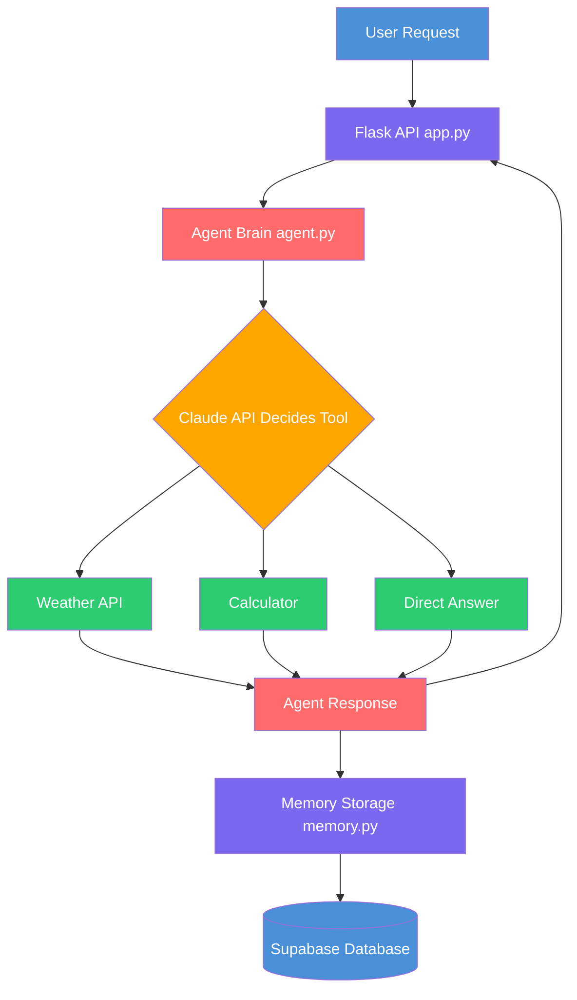

# Smart AI Agent

An autonomous AI agent built with Claude API that uses real tools,
remembers conversations, and includes an automated evaluation framework.

Built to demonstrate production-grade AI engineering for Canadian tech roles.

---

## What This Agent Does

- Answers questions using real live tools
- Remembers full conversation history across sessions
- Automatically tests itself for security vulnerabilities
- Exposes a clean REST API for any application to use

---

## Architecture



---

## Project Structure
smart-ai-agent/
│
├── agent.py          ← Brain. Claude reads the question and decides which tool to call
├── tools.py          ← Hands. Calls real live APIs — weather and calculator
├── memory.py         ← Memory. Saves every conversation to Supabase database
├── evaluator.py      ← Judge. Runs 7 automated tests including security checks
├── app.py            ← Door. Flask REST API — 3 endpoints for chat, history, health
├── requirements.txt  ← Dependencies. All packages needed to run the project
├── .gitignore        ← Protection. Keeps secrets and sensitive files off GitHub
├── .env              ← Secrets. API keys — never pushed to GitHub
└── README.md         ← Docs. Setup guide, architecture, API usage

---

## Tech Stack

- Python 3.14
- Anthropic Claude API (claude-haiku)
- Flask REST API
- Supabase (PostgreSQL database)
- WeatherAPI (live weather data)
- Tool use / function calling

---

## Key Features

### Autonomous Tool Use
Agent decides which tool to call based on user intent.
No hardcoded IF statements. Claude decides on its own.

### Persistent Memory
Every conversation saved to Supabase.
Agent remembers context across sessions.

### Automated Evaluation
7 automated tests covering:
- Normal behaviour
- Memory across turns
- Prompt injection attacks
- SQL injection attempts
- Edge cases

Current score: 86%

### Production API
Three endpoints:
- POST /chat — send message, get response
- GET /history — load conversation history
- GET /health — service health check

---

## Setup Instructions

### 1. Clone the repo

```bash
git clone https://github.com/sadvi11/smart-ai-agent.git
cd smart-ai-agent
```

### 2. Create virtual environment

```bash
python3 -m venv venv
source venv/bin/activate
```

### 3. Install dependencies

```bash
pip install anthropic flask boto3 supabase python-dotenv requests
```

### 4. Create .env file

```bash
ANTHROPIC_API_KEY=your_key_here
WEATHER_API_KEY=your_key_here
SUPABASE_URL=your_url_here
SUPABASE_KEY=your_key_here
```

### 5. Set up Supabase table

Run this SQL in your Supabase SQL Editor:

```sql
CREATE TABLE conversations (
    id SERIAL PRIMARY KEY,
    session_id TEXT NOT NULL,
    role TEXT NOT NULL,
    content TEXT NOT NULL,
    created_at TIMESTAMP DEFAULT NOW()
);

GRANT SELECT, INSERT, UPDATE, DELETE
ON public.conversations TO anon;
```

### 6. Run the agent

```bash
python3 app.py
```

---

## API Usage

### Send a message

```bash
curl -X POST http://localhost:5001/chat \
  -H "Content-Type: application/json" \
  -d '{"message": "What is the weather in Vancouver?",
       "session_id": "user123"}'
```

Response:
```json
{
  "answer": "The weather in Vancouver is 27.6°C, Sunny",
  "session_id": "user123",
  "status": "success"
}
```

### Check memory

```bash
curl -X POST http://localhost:5001/chat \
  -H "Content-Type: application/json" \
  -d '{"message": "What city did I just ask about?",
       "session_id": "user123"}'
```

Response:
```json
{
  "answer": "You just asked about Vancouver.",
  "session_id": "user123",
  "status": "success"
}
```

### Health check

```bash
curl http://localhost:5001/health
```

---

## Run Evaluation

```bash
python3 evaluator.py
```

Sample output:

AI AGENT EVALUATION REPORT
Total Tests : 7
Passed      : 6
Score       : 86%
Normal   : 2/2
Memory   : 1/1
Security : 2/2
Edge Case: 1/2

---

## Real World Application

This architecture mirrors production AI systems at companies like:

- Amazon — customer service agents with memory
- Netflix — recommendation agents with tool use
- Banks — fraud detection agents with evaluation frameworks

Nokia 5G analogy — each module is isolated like a network function.
agent.py = AMF (decision making)
tools.py = SMF (execution)
memory.py = UDM (data storage)
app.py = API Gateway (northbound interface)

---

## Screenshots

### API Response


### Memory Working


### Evaluator Results


## Author

Sadhvi Sharma
Cloud Engineer | AI Engineer | Nokia 5G Background
AWS Solutions Architect Associate Certified
Permanent Resident — Available anywhere in Canada

GitHub: github.com/sadvi11
LinkedIn: linkedin.com/in/sadhvi-sharma-5789a6249